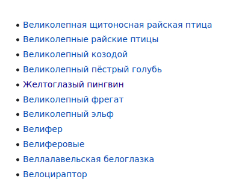

## Тестовое задание для онлайн-школы "Тетрика".

Перед запуском скриптов выполните установку зависимостей.
```
pip install -r requirements.txt
```

### Примечание к 2 задаче.
В ходе отладки программы выяснилось, что на странице "Категория:Животные по алфавиту"
очень редко могут попадаться неотсортированные элементы (как на скриншоте). в некоторых случаях это может повлиять на результат выполнения
скрипта, так как в нём используется алгоритм бинарного поиска по списку статей.

